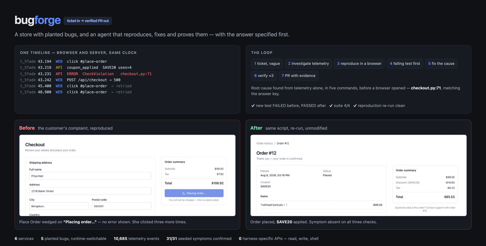

# bugforge

**A fake online store with hidden bugs, and a robot that fixes them.**

Give the robot a customer complaint. It looks up what actually happened, reproduces
the bug in a real browser, fixes it, proves it's fixed, and opens a PR with the video
attached.

---

## The two halves

**The store** — a small shop app (login → cart → coupon → checkout → orders) running in
Docker. Both the frontend and the backend record everything they do into one telemetry
store, linked by a shared trace ID. Five bugs are deliberately planted in it, each
switchable at runtime. We know exactly where each one is.

**The robot** — an agent that turns a ticket into a pull request:

1. Searches telemetry for that customer's session → sees the real error
2. Reads the code at the crash site → forms a hypothesis
3. Drives a real browser to reproduce it → confirms
4. Writes a test that fails
5. Fixes the code
6. Re-runs the exact browser reproduction → proves the symptom is gone
7. Opens a PR: root cause, evidence timeline, before/after video

"Cannot reproduce" and "working as intended" are valid outcomes. One of the five
tickets is not a real bug.

---

## Why the store exists

It is not a demo of the robot. It is the **test track**. You cannot tell whether a
bug-fixing agent got the right answer unless you planted the bug yourself. The store
is the answer sheet.

---

## Build phases

| Phase | Deliverable | Done when |
|-------|-------------|-----------|
| **P0** | Store + API + Postgres in Docker, seeded | You can click through and place an order |
| **P1** | Trace IDs, collector, both telemetry streams | One query returns the merged front+back timeline for a click |
| **P2** | Bug switches, 5 bugs, 5 tickets, ghost runs | Flip a switch and the store misbehaves; telemetry already has the customer's session |
| **P3** | Robot: investigate + reproduce, **no fixing** | Robot reads a ticket and hands back a correct diagnosis + video |
| **P4** | Robot: failing test → fix → verify | Robot fixes a bug and proves it |
| **P5** | Gitea + PRs with evidence attached | A PR exists you can open and read |
| **P6** | All 5 tickets end to end, polish | Demo recordable in one take |

P1 is load-bearing. P3 is the first checkpoint that matters — if the diagnosis is
wrong, the fixing doesn't matter.

## Stack

Next.js · FastAPI · Postgres · Playwright · Gitea · Docker Compose

Reproductions are deterministic Playwright scripts. `bf repro explore` can use
browser-use to draft one from a plain-English goal, but it is optional and was not
used for the recorded run — without it the command scaffolds the script instead.

## Docs

- [`docs/01-store-spec.md`](docs/01-store-spec.md) — the store: architecture, data model, telemetry contract, bug catalog
- [`docs/03-agent-spec.md`](docs/03-agent-spec.md) — the agent: why it is a skill + CLI, and how it stays harness-agnostic
- [`docs/05-submission.md`](docs/05-submission.md) — what was built, what works, what does not
- [`skills/bug-triage/SKILL.md`](skills/bug-triage/SKILL.md) — the skill itself

## Example output

[PR #1](https://github.com/mohitpaddhariya/bugforge/pull/1) — ticket #1042 triaged end
to end: root cause with file and line, the evidence timeline, before/after recordings,
and the reproduction script so a reviewer can run it themselves.
